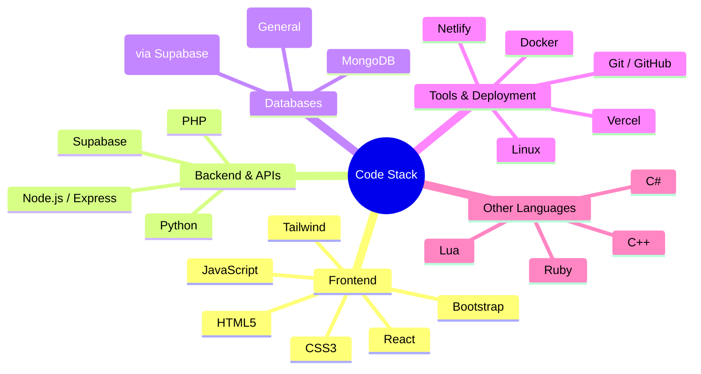

  

<!--
<h1 align="center">WiiZARDD</h1>

  I am a creative builder and self taught developer passionate about bringing ideas to life through code. 
  I specialize in HTML, CSS, and JavaScript, and I'm expanding into Full Stack Development with tools like Node.js, React, and SQL. 
  My journey spans web design, scripting, automation, and digital projects that push boundaries.

-->

<!--

  

-->

  

  
  
  

  
  

  

  
  
  
  
  
  
  
  
  
  
  
  
  
  
  
  
  
  

---

<!--
## GitHub Stats

 

  

-->

<!--

  

  

  
  
  

-->

<!--
## 🖥️ Code Stack

### 🌐 Frontend
| Technology | Level | Icon |
|------------|:-----:|:----:|
| HTML5      | 🟢 Advanced     |  |
| CSS3       | 🟢 Advanced     |  |
| JavaScript | 🟡 Intermediate |  |
| React      | 🟡 Intermediate |  |
| Tailwind   | 🟡 Intermediate |  |
| Bootstrap  | 🟡 Intermediate |  |

### ⚙️ Backend & APIs
| Technology | Level | Icon |
|------------|:-----:|:----:|
| Node.js / Express | 🔴 Learning |  |
| Supabase    | 🟡 Intermediate |  |
| Python      | 🟡 Intermediate |  |
| PHP         | 🔴 Exploring    |  |

### 🗄️ Databases
| Technology | Level | Icon |
|------------|:-----:|:----:|
| PostgreSQL (via Supabase) | 🟡 Intermediate |  |
| MongoDB    | 🔴 Learning |  |
| SQL (General) | 🟡 Intermediate |  |

### 🛠️ Tools & Deployment
| Tool / Platform | Level | Icon |
|-----------------|:-----:|:----:|
| Git / GitHub    | 🟢 Advanced     |  |
| Linux           | 🟡 Intermediate |  |
| Docker          | 🔴 Exploring    |  |
| Vercel          | 🟡 Intermediate |  |
| Netlify         | 🟡 Intermediate |  |

### 🔧 Other Languages
| Technology | Level | Icon |
|------------|:-----:|:----:|
| C++   | 🔴 Exploring |  |
| C#    | 🔴 Exploring |  |
| Lua   | 🔴 Exploring |  |
| Ruby  | 🔴 Exploring |  |

-->

<!-- Proudly created with ❤️ by WiiZARDD -->
