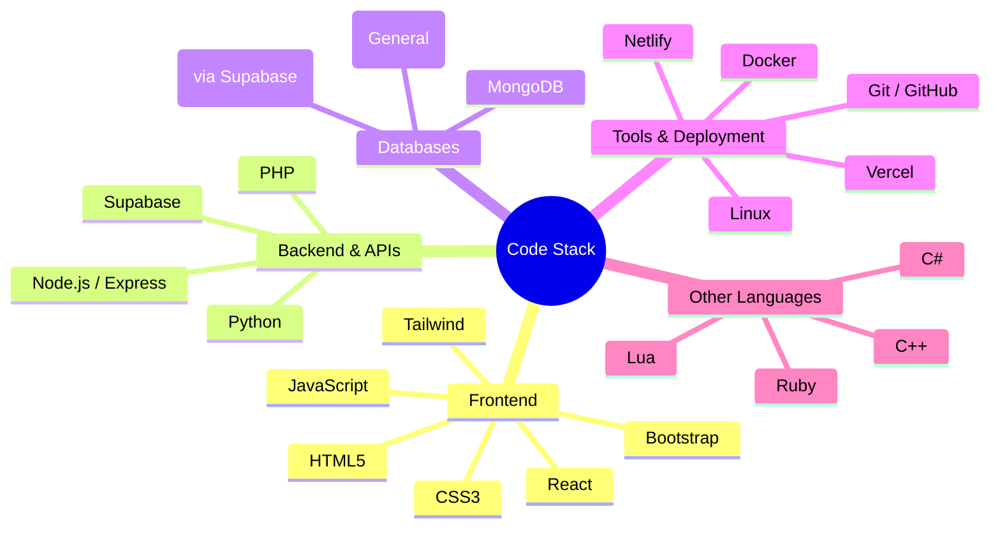

<!--
<p align="center">
  
</p>
-->

<p align="center">
  
</p>

<h1 align="center">/WiiZARDD</h1>

<p align="center">
  <a href="https://jokerobfuscator.com">
    
  </a>
  <a href="https://discord.gg/jokerobfuscator">
    
  </a>
  <a href="https://github.com/WiiZARDD?tab=followers">
    
  </a>
</p>

<p align="center">
  
</p>

---

```text
 8888 .d88b. 8  dP 8888 888b.    .d88b. 888b. 8888 8    8 .d88b. .d88b    db    88888 .d88b. 888b. 
   8  8P  Y8 8wdP  8www 8  .8    8P  Y8 8wwwP 8www 8    8 YPwww. 8P      dPYb     8   8P  Y8 8  .8 
w  8  8b  d8 88Yb  8    8wwK'    8b  d8 8   b 8    8b..d8     d8 8b     dPwwYb    8   8b  d8 8wwK'     discord.gg/JokerObfusctor
`Yw"  `Y88P' 8  Yb 8888 8  Yb    `Y88P' 888P' 8    `Y88P' `Y88P' `Y88P dP    Yb   8   `Y88P' 8  Yb
```

---

<table align="center">
  <tr>
    <td width="520" valign="top">
      <h3>🃏 Joker Obfuscator</h3>
      <p>
        A project focused on advanced code protection and a clean product experience.
        Built for developers who want something stronger, sharper, and more serious than surface level scrambling.
      </p>
      <p>
        <a href="https://jokerobfuscator.com">Website</a> •
        <a href="https://discord.gg/jokerobfuscator">Discord</a>
      </p>
    </td>
    <td valign="center">
      
    </td>
  </tr>
</table>

---



```mermaid
mindmap
  root((Code Stack))
    Frontend
      HTML5
      CSS3
      JavaScript
      React
      Tailwind
      Bootstrap
    Backend & APIs
      Node.js / Express
      Supabase
      Python
      PHP
    Databases
      PostgreSQL (via Supabase)
      MongoDB
      SQL (General)
    Tools & Deployment
      Git / GitHub
      Linux
      Docker
      Vercel
      Netlify
    Other Languages
      C++
      C#
      Lua
      Ruby
```

<!--
## 🖥️ Code Stack

### 🌐 Frontend
| Technology | Level | Icon |
|------------|:-----:|:----:|
| HTML5      | 🟢 Advanced     |  |
| CSS3       | 🟢 Advanced     |  |
| JavaScript | 🟡 Intermediate |  |
| React      | 🟡 Intermediate |  |
| Tailwind   | 🟡 Intermediate |  |
| Bootstrap  | 🟡 Intermediate |  |

### ⚙️ Backend & APIs
| Technology | Level | Icon |
|------------|:-----:|:----:|
| Node.js / Express | 🔴 Learning |  |
| Supabase    | 🟡 Intermediate |  |
| Python      | 🟡 Intermediate |  |
| PHP         | 🔴 Exploring    |  |

### 🗄️ Databases
| Technology | Level | Icon |
|------------|:-----:|:----:|
| PostgreSQL (via Supabase) | 🟡 Intermediate |  |
| MongoDB    | 🔴 Learning |  |
| SQL (General) | 🟡 Intermediate |  |

### 🛠️ Tools & Deployment
| Tool / Platform | Level | Icon |
|-----------------|:-----:|:----:|
| Git / GitHub    | 🟢 Advanced     |  |
| Linux           | 🟡 Intermediate |  |
| Docker          | 🔴 Exploring    |  |
| Vercel          | 🟡 Intermediate |  |
| Netlify         | 🟡 Intermediate |  |

### 🔧 Other Languages
| Technology | Level | Icon |
|------------|:-----:|:----:|
| C++   | 🔴 Exploring |  |
| C#    | 🔴 Exploring |  |
| Lua   | 🔴 Exploring |  |
| Ruby  | 🔴 Exploring |  |

-->

<!-- Proudly created with ❤️ by WiiZARDD -->
