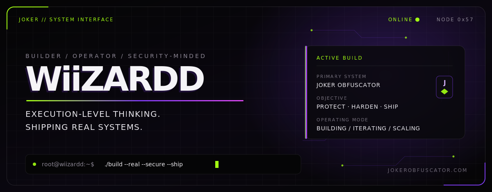

<!--
  WiiZARDD // GitHub Profile Interface
  Built as a product surface, not a résumé.
-->

<div align="center">
  <a href="https://jokerobfuscator.com">
    
  </a>
</div>

<br />

<div align="center">
  
</div>

<br />

<div align="center">
  <a href="https://jokerobfuscator.com">
    
  </a>
  <a href="https://discord.gg/jokerobfuscator">
    
  </a>
  <a href="https://github.com/WiiZARDD?tab=followers">
    
  </a>
</div>

<br />

> **I build developer products where code protection, product quality, and execution meet.** The current primary system is **Joker Obfuscator**—advanced code protection wrapped in a clean, serious developer experience.

<br />

<table>
  <tr>
    <td width="61%" valign="top">
      <h2>01 // PRIMARY SYSTEM</h2>
      <h3>🃏 Joker Obfuscator</h3>
      <p>
        A code-protection product built for developers who need more than cosmetic scrambling.
        The objective is straightforward: make protection stronger without turning the product into a hostile black box.
      </p>
      <br />
      <p>
        <code>INPUT</code> &nbsp;→&nbsp;
        <code>TRANSFORM</code> &nbsp;→&nbsp;
        <code>HARDEN</code> &nbsp;→&nbsp;
        <code>SHIP</code>
      </p>
      <br />
      <a href="https://jokerobfuscator.com"><b>Launch website ↗</b></a>
      &nbsp;&nbsp;·&nbsp;&nbsp;
      <a href="https://discord.gg/jokerobfuscator"><b>Enter community ↗</b></a>
    </td>
    <td width="39%" valign="top">
      <h2>02 // OPERATOR STATE</h2>
      <pre><code>MODE       execution
FOCUS      code protection
BIAS       shipping
STANDARD   production
LOOP       build → test → harden
STATUS     active</code></pre>
      <p>
        I care about systems that survive contact with users—not demos that only look finished.
      </p>
    </td>
  </tr>
</table>

<br />

<h2 align="center">03 // BUILD SURFACE</h2>

<div align="center">
  
</div>

<br />

<table>
  <tr>
    <td align="center" width="20%">
      <sub>PRODUCT</sub><br /><br />
      <b>React</b><br />
      <b>Tailwind</b><br />
      <b>JavaScript</b>
    </td>
    <td align="center" width="20%">
      <sub>SERVICES</sub><br /><br />
      <b>Node.js</b><br />
      <b>Express</b><br />
      <b>Python</b>
    </td>
    <td align="center" width="20%">
      <sub>DATA</sub><br /><br />
      <b>Supabase</b><br />
      <b>PostgreSQL</b><br />
      <b>MongoDB</b>
    </td>
    <td align="center" width="20%">
      <sub>RUNTIME</sub><br /><br />
      <b>Lua</b><br />
      <b>C++ / C#</b><br />
      <b>PHP / Ruby</b>
    </td>
    <td align="center" width="20%">
      <sub>DELIVERY</sub><br /><br />
      <b>GitHub</b><br />
      <b>Linux</b><br />
      <b>Docker</b>
    </td>
  </tr>
</table>

<br />

<details open>
  <summary><b>04 // SYSTEM MAP</b></summary>
  <br />

```text
┌──────────────────────────────────────────────────────────────────────┐
│  PRODUCT LAYER     React · Tailwind · JavaScript · HTML · CSS       │
├──────────────────────────────────────────────────────────────────────┤
│  SERVICE LAYER     Node.js · Express · Python · PHP · Supabase      │
├──────────────────────────────────────────────────────────────────────┤
│  DATA LAYER        PostgreSQL · SQL · MongoDB                       │
├──────────────────────────────────────────────────────────────────────┤
│  RUNTIME LAYER     Lua · C++ · C# · Ruby                            │
├──────────────────────────────────────────────────────────────────────┤
│  DELIVERY LAYER    Git · GitHub · Linux · Docker · Vercel · Netlify│
└──────────────────────────────────────────────────────────────────────┘
```

</details>

<br />

<table>
  <tr>
    <td width="50%" valign="top">
      <h2>05 // BUILD RULES</h2>
      <p><b>01.</b> Build the real system, not the presentation of one.</p>
      <p><b>02.</b> Keep the interface clean and the internals deliberate.</p>
      <p><b>03.</b> Prefer leverage, observability, and repeatable execution.</p>
      <p><b>04.</b> Ship, measure, harden, repeat.</p>
    </td>
    <td width="50%" valign="top">
      <h2>06 // OPEN CHANNEL</h2>
      <p>
        Building something serious, working on developer infrastructure, or operating near code protection?
      </p>
      <p>
        <a href="https://discord.gg/jokerobfuscator"><b>Discord</b></a>
        &nbsp;·&nbsp;
        <a href="https://jokerobfuscator.com"><b>Website</b></a>
        &nbsp;·&nbsp;
        <a href="https://github.com/WiiZARDD"><b>GitHub</b></a>
      </p>
      <br />
      <code>signal accepted // noise rejected</code>
    </td>
  </tr>
</table>

<br />

<div align="center">
  
  <br /><br />
  <sub><code>WiiZARDD // JOKER OBFUSCATOR // BUILD 01</code></sub>
</div>
